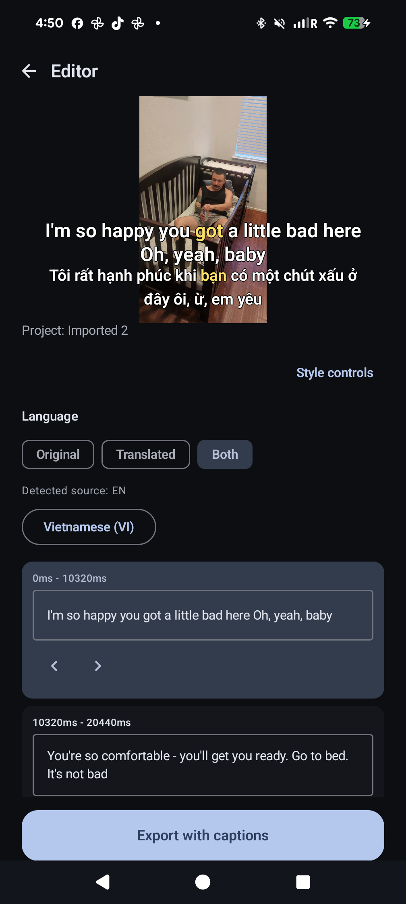
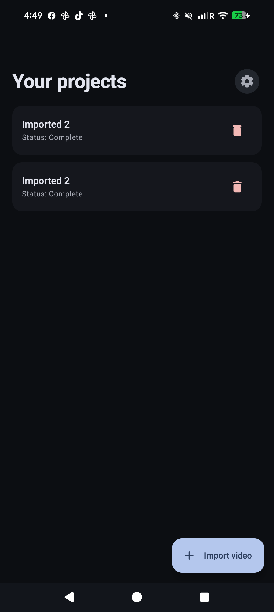
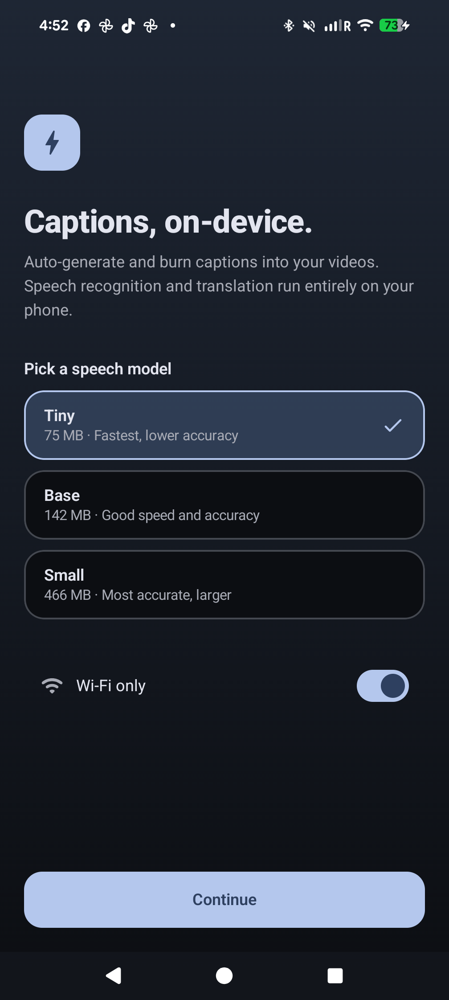
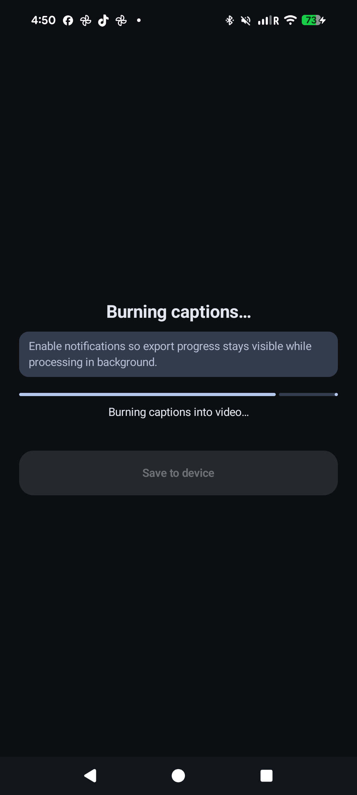

<div align="center">

# CaptionBurn

### Captions, on-device.

**Auto-caption your videos and burn the subtitles in — entirely on your phone.**
No cloud, no uploads, no waiting.

[**Visit the website →**](https://chartmann1590.github.io/captionburn/)
&nbsp;·&nbsp;
[**Latest release →**](https://github.com/chartmann1590/captionburn/releases/latest)
&nbsp;·&nbsp;
[**☕ Buy me a coffee**](https://buymeacoffee.com/charleshartmann)



</div>

---

## Why CaptionBurn

- **🔒 Privacy-first** — Your video never leaves the device. Speech recognition runs locally with [Whisper](https://github.com/ggerganov/whisper.cpp). Translation runs locally with Google ML Kit. No accounts, no uploads, no telemetry.
- **⚡ Fast** — On-device transcription with word-level timing. Pick a video, get captions in seconds.
- **🎨 You're in control** — Edit every caption before you export. Pick the font size, position, outline, color, and word-highlight style. Translate to a second language if you want.

## Features

| | |
|---|---|
| **🎤 99 languages transcribed** | Whisper auto-detects the language of your video. Three model sizes (Tiny / Base / Small) — pick speed or accuracy. |
| **🌐 50+ languages translated** | Tap a language, get a translated caption track on the same video. ML Kit downloads the language pack once. |
| **🪄 Burned-in captions** | Captions are baked into the pixels — they show everywhere, on every platform, with no separate subtitle file. |
| **✏️ Edit anything** | Tap any caption to fix a word. Adjust word timing. Re-render in seconds. |
| **🎨 Style controls** | Size 36–110, 9 positions, outline 0–8 px, 5 text colors, 5 highlight colors, 4 word-effect styles (none / fill / grow / underline). |
| **📂 Stays in your gallery** | Exports to your device's Movies/CaptionBurn folder. Share, post, or save normally. |

## How it works

<div align="center">

| 1. Import | 2. Transcribe | 3. Style | 4. Export |
|:---:|:---:|:---:|:---:|
|  |  |  |  |
| Pick any video from your gallery | Whisper transcribes on-device with word-level timing | Choose font, color, position, word effects | Captions burned into the video, saved to your gallery |

</div>

## Privacy in plain English

- Your **video stays on your device.** It is never uploaded.
- Your **transcript stays on your device.** It is never uploaded.
- The Whisper speech model is **downloaded once** from public CDNs (HuggingFace), then runs offline forever.
- ML Kit **downloads small translation packs** (one per language) from Google's CDN. The pack is downloaded — your text is not uploaded.
- The app shows **a banner ad and an occasional interstitial ad** via Google AdMob. AdMob receives standard ad-platform info (advertising ID, IP, app interactions). That's it.

[Read the full privacy policy →](https://chartmann1590.github.io/captionburn/privacy.html)

## Install

> Until the Google Play Store listing is live, install directly from the GitHub Releases page.

1. Go to [**Releases**](https://github.com/chartmann1590/captionburn/releases/latest).
2. Download the right APK for your phone:
   - `app-arm64-v8a-release.apk` — modern Android phones (most users)
   - `app-armeabi-v7a-release.apk` — older 32-bit ARM phones
   - `app-x86_64-release.apk` — emulators / Chromebooks
3. Open the APK on your phone and follow the install prompt. (You may need to allow installs from unknown sources for your browser.)

## Support the work

CaptionBurn is free, MIT-licensed, and built by one person. If it helps you, **[buy me a coffee ☕](https://buymeacoffee.com/charleshartmann)** — it keeps the lights on.

---

<details>
<summary><strong>For developers</strong></summary>

### Build locally

```sh
git clone https://github.com/chartmann1590/captionburn.git
cd captionburn
# Create local.properties with your AdMob test keys (see app/build.gradle.kts for the keys read).
./gradlew :app:assembleDebug
```

Java 17 + Android SDK 35 + NDK 28.2.13676358 required. The project pins these via the Gradle wrapper and `ndkVersion`.

### CI/CD

Every push to `main` triggers `.github/workflows/release.yml`:

1. **`test`** — runs unit tests (`./gradlew testDebugUnitTest`)
2. **`build`** — assembles signed release APKs (per-ABI) + AAB, gates on 16 KB page alignment
3. **`release`** — publishes a GitHub Release with all artifacts and a `mapping.txt` for crash deobfuscation

`versionCode` is auto-incremented from `github.run_number + 100`; `versionName` becomes `0.1.<run_number>`.

### Required GitHub Secrets

| Secret | Purpose |
|---|---|
| `KEYSTORE_BASE64` | Upload key (base64 of the `.jks` file) |
| `KEYSTORE_PASSWORD` | Keystore password |
| `KEY_ALIAS` | Key alias inside the keystore |
| `KEY_PASSWORD` | Key password |
| `ADMOB_APP_ID` | AdMob app ID |
| `ADMOB_BANNER_AD_UNIT_ID` | Banner ad unit ID |
| `ADMOB_INTERSTITIAL_AD_UNIT_ID` | Interstitial ad unit ID |
| `ADMOB_NATIVE_ADVANCED_AD_UNIT_ID` | Native advanced ad unit ID |

### 16 KB page size

All native libraries (FFmpeg suite, FFmpegKit, whisper.cpp, ML Kit, libc++_shared) are aligned at `0x4000` (16 KB) per [Android's 16 KB page size requirement](https://developer.android.com/guide/practices/page-sizes), thanks to NDK r28+. The CI pipeline gates every release on `zipalign -c -P 16`.

</details>

---

## License

App source: [MIT](LICENSE).
Native dependencies (FFmpegKit Full **GPL**, whisper.cpp MIT, ML Kit per Google ToS) are licensed under their own terms — see each project for the exact requirements when redistributing compiled binaries.

---

<div align="center">
  <sub>Built with care by <a href="https://github.com/chartmann1590">Charles Hartmann</a> · <a href="https://buymeacoffee.com/charleshartmann">Buy me a coffee ☕</a></sub>
</div>
